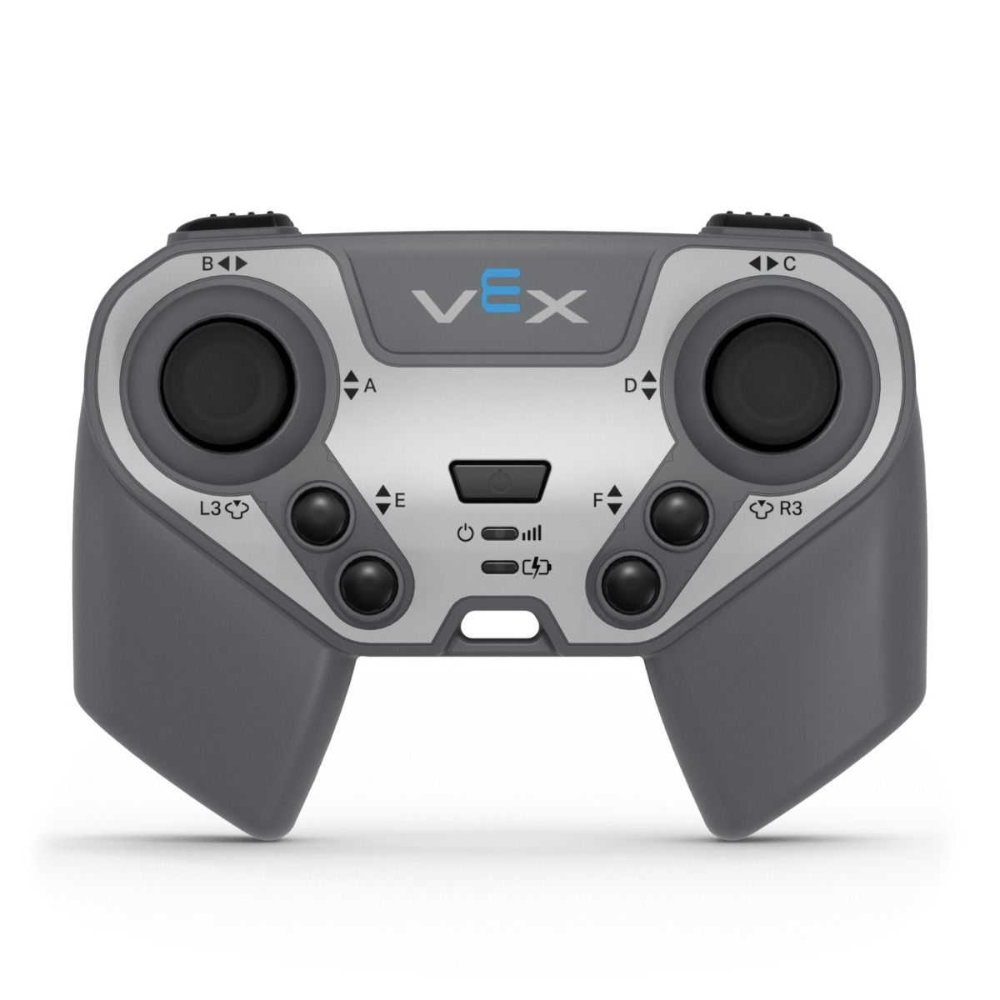

# Drive Code

There are 2 different types of drive stick mappings

* [Tank Drive](tank-drive.md)
* [Arcade Drive](arcade-drive.md)

In order to understand these 2 different stick mappings we have to understand the stick axes in the vex IQ controller

### Vex IQ Gen 2 Controller

<figure><figcaption>
Image taken from vexrobotics.com
</figcaption></figure>

The vex IQ gen 2 controller has 2 joysticks. They each have 2 axes with horizontal and vertical axes.&#x20;

| Stick       | Horizontal | Vertical |
| ----------- | ---------- | -------- |
| Left Stick  | B          | A        |
| Right Stick | C          | D        |

Keep this in mind as we will have to use this to code our drive.
